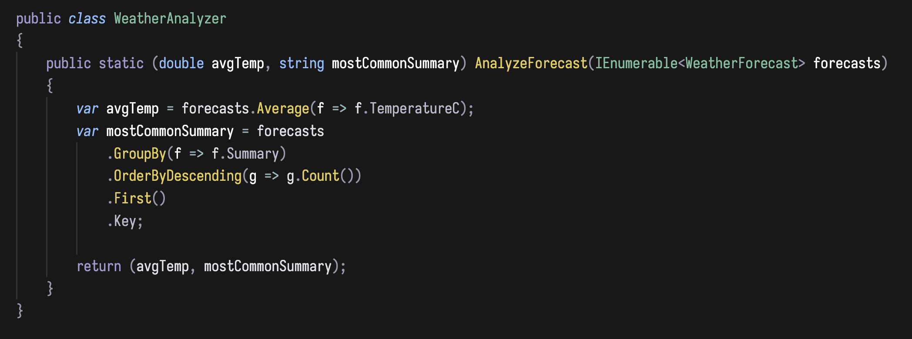

# Night Shade Theme for VS Code

A dark theme for late night coding sessions, inspired by Gruber Minimal with additional vibrant highlights.

## Features

- Toned down vibrant colors for clarity aesthetics, without sacrificing eye strain
- Subtle syntax highlighting for improved readability
- Compatible with various programming languages
- Optimized for low-light environments

## Installation

1. Open VS Code
2. Go to Extensions (Ctrl+Shift+X or Cmd+Shift+X on macOS)
3. Search for "Night Shade Theme"
4. Click Install
5. Select "Night Shade Color Theme" from the Color Theme picker (Ctrl+K Ctrl+T or Cmd+K Cmd+T on macOS)

## Theme Demos

## Language Examples

[Placeholders for code snippets in various languages]

## Customization

Override colors in your `settings.json`:
