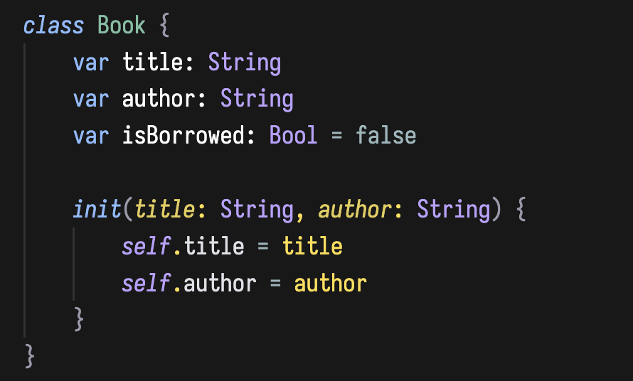
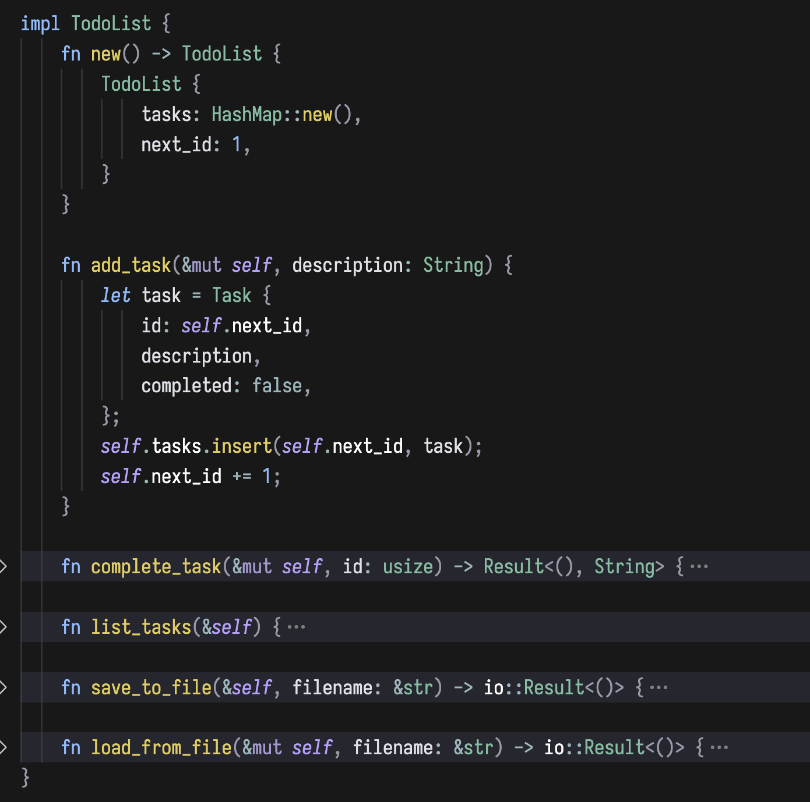
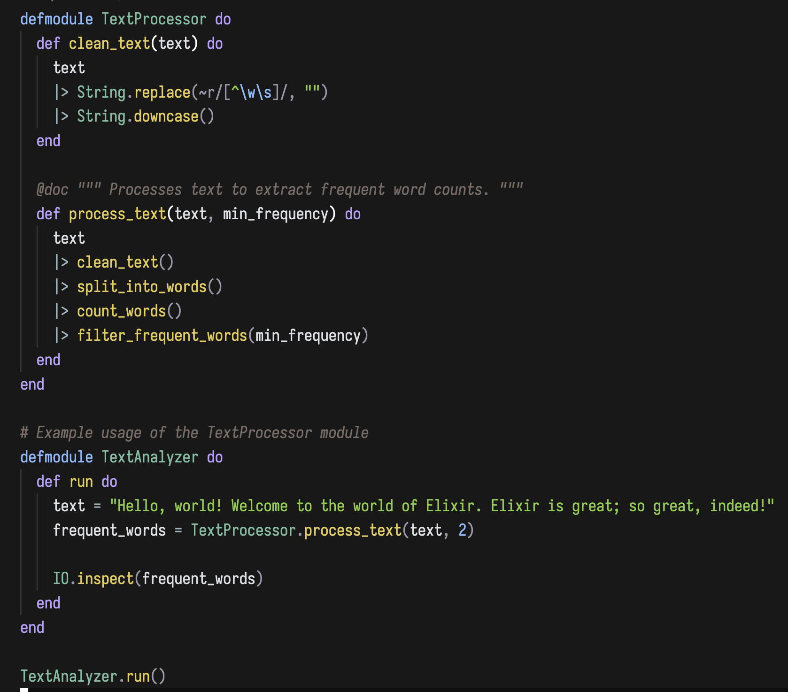

# Night Shade Theme for VS Code

A minimal dark theme for late night coding sessions.

## Feedback / Issues

See anything that looks bad or just off? Feel free to take a screenshot and open an issue on github.

## Customization

Override colors in your `settings.json` for personalization:
